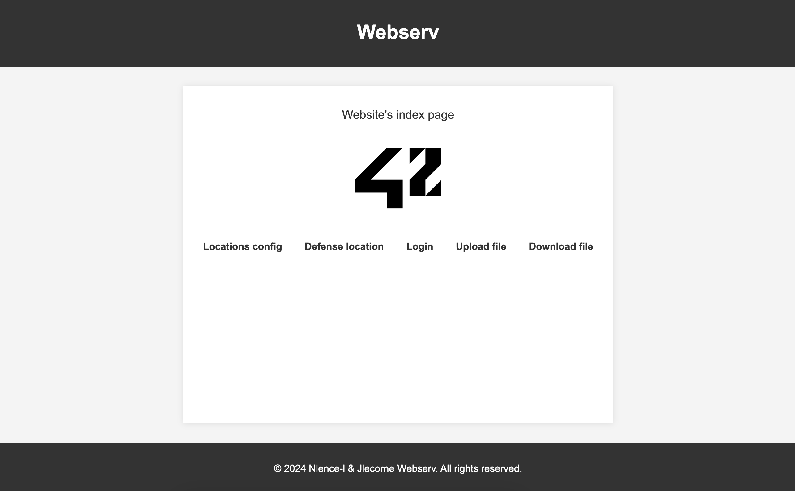

```text
        :::      ::::::::
      :+:      :+:    :+:
    +:+ +:+         +:+
  +#+  +:+       +#+
+#+#+#+#+#+   +#+
     #+#    #+#
    ###   ########.fr
```

# Webserv

**Un serveur HTTP en C++98 inspiré de Nginx**



## 📝 Description

Webserv est un projet de l'École 42 visant à développer un serveur HTTP capable de gérer des requêtes basiques en **C++98**. 
L’objectif est de comprendre les principes fondamentaux des serveurs web et d’implémenter certaines fonctionnalités de **NGINX**.

## 🎯 Objectifs

Ce projet permet de développer plusieurs compétences essentielles :
- **Programmation réseau en C++** (gestion des sockets, connexions multiples).
- **Gestion de la concurrence** avec `poll()` ou équivalent.
- **Lecture et validation de fichiers de configuration**.
- **Parsage et gestion des requêtes HTTP**.
- **Implémentation des réponses HTTP et des codes d’erreur.**

## 🚀 Fonctionnalités Clés

- **Gestion des requêtes HTTP** : Support des méthodes **GET, POST, DELETE**.
- **Fichier de configuration** permettant de personnaliser les serveurs.
- **Gestion des erreurs HTTP** avec des pages d’erreur dynamiques.
- **Exécution de scripts CGI** (ex: PHP, Python).
- **Support du téléchargement de fichiers**.
- **Gestion de multiples serveurs écoutant sur différents ports.**

## 🔧 Prérequis & Installation

### **1. Prérequis**
- **Compilateur C++98**
- **Make**

### **2. Installation**
- **Cloner le projet** :
  ```bash
  git clone https://github.com/LcntJulien/42-Webserv.git
  ```
- **Compiler le serveur** :
  ```bash
  make
  ```
- **Lancer Webserv** :
  ```bash
  ./webserv conf/example.conf
  ```

## 🛠 Fichier de Configuration

Le serveur est configurable via un fichier `.conf` contenant :
- **Les ports et hôtes** sur lesquels écouter.
- **Les routes disponibles et leurs restrictions (GET, POST, DELETE).**
- **Les pages d’erreur personnalisées.**
- **Le support des CGI.**

### **Exemple de fichier de configuration**
```ini
server {
    listen 8080;
    server_name test.com;

    root /Users/julien/Documents/42/webserv/www/site1.com;
    index index.html;

    location / {
        limit_except GET;
        autoindex on;
    }

    location /uploads/ {
        autoindex on;
    }

    location /cgi-bin/ {
        limit_except POST;
        cgi_path /Users/julien/Documents/42/webserv/www/cgi-bin;
        cgi_ext .py .php .cgi;
    }
}
```

## 📂 Structure du Projet

```sh
webserv/
├── srcs/           # Code source du serveur
├── include/        # Headers du projet
├── conf/           # Exemples de fichiers de configuration
├── www/            # Site pour utilisation du serveur
└── Makefile        # Compilation du projet
```

## 💡 Fonctionnement du Serveur

1. **Lecture du fichier de configuration**
2. **Création et configuration des sockets**
3. **Attente des connexions clients**
4. **Gestion des requêtes HTTP via `epoll()`**
5. **Envoi de réponses HTTP aux clients**
6. **Gestion des scripts CGI et des fichiers uploadés**

## 🔥 Débogage et Nettoyage

### **Mode Debug**
```bash
make debug
```
Active **fsanitize=address** pour détecter les erreurs mémoire.

### **Nettoyage des fichiers compilés**
```bash
make fclean
```

## 🏆 Améliorations Futures

- ✅ Support du protocole WebSocket.
- ✅ Gestion avancée des sessions et des cookies.
- ✅ Optimisation des performances.